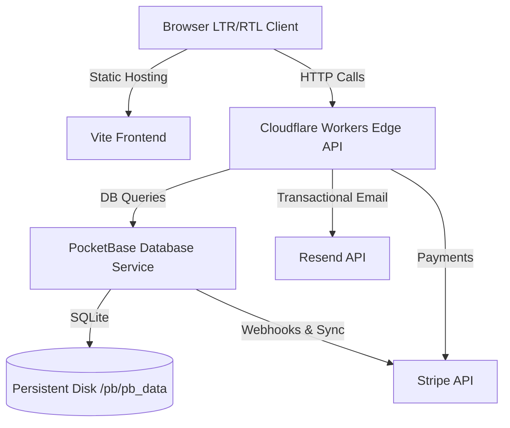

# Instant Grow — Production Deployment Guide

This guide outlines all the necessary steps to deploy the **Instant Grow** platform (frontend, serverless functions, database, and payment synchronization) to a production environment.

---

## Architecture Overview



---

## Pre-requisites

Gather the following accounts, credentials, and CLI tools before starting:

### 1. External Service Accounts & Keys
- **Stripe Account**: For payment processing. You will need:
  - Live Secret Key (`sk_live_...`) or Test Secret Key (`sk_test_...`).
- **Resend Account**: For sending transactional emails. You will need:
  - Resend API Key (`re_...`).
  - A verified domain in Resend to send emails from (e.g., `instantgrow.net`).
- **Cloudflare Account**: For hosting serverless Workers and optionally the frontend.

### 2. Required CLI Tools
- **Node.js** (v18 or higher)
- **Wrangler CLI** (for Cloudflare Workers):
  ```bash
  npm install -g wrangler
  ```
- **Fly CLI** (if hosting PocketBase on Fly.io):
  - [Fly CLI Installation Guide](https://fly.io/docs/hands-on/install-cli/)

---

## Step 1: Deploy PocketBase Database

PocketBase holds all data (users, orders, companies, documents, payments). It requires a persistent disk mount since it uses SQLite.

### Option A: Deploying on Fly.io (Recommended)

1. Open your terminal and navigate to the `pocketbase/` directory:
   ```bash
   cd pocketbase
   ```
2. Log in to your Fly.io account:
   ```bash
   fly auth login
   ```
3. Launch the deployment configuration:
   ```bash
   fly launch
   ```
   *Note:* Follow the prompts to create the app. Fly.io will automatically parse [fly.toml](file:///g:/Vibe%20coding/IG%20website%20V2/pocketbase/fly.toml), build the [Dockerfile](file:///g:/Vibe%20coding/IG%20website%20V2/pocketbase/Dockerfile), allocate a persistent volume (`pb_data`), and attach it to `/pb/pb_data`.
4. Add your production Stripe Secret Key to PocketBase (required for database-level event synchronization):
   ```bash
   fly secrets set STRIPE_SECRET_KEY="sk_live_your_key"
   ```

### Option B: Deploying on a VPS (Docker)

1. Copy the `pocketbase/` folder to your server.
2. Build the Docker image:
   ```bash
   docker build -t pocketbase-prod -f pocketbase/Dockerfile pocketbase
   ```
3. Run the container with a persistent volume:
   ```bash
   docker run -d \
     -p 80:8080 \
     -v pb_data:/pb/pb_data \
     -e STRIPE_SECRET_KEY="sk_live_your_key" \
     --name pocketbase-prod \
     pocketbase-prod
   ```

### ⚠️ Critical First-Boot Task
Immediately after PocketBase is online (e.g. at `https://your-pb-domain.com/_/`):
1. Navigate to `https://your-pb-domain.com/_/` in your browser.
2. Create your **first admin superuser account** with a secure email and password.
3. Save these credentials, as they are needed for serverless Workers and database seeding scripts.

---

## Step 2: Configure and Deploy Cloudflare Workers

We have core edge functions in the `functions/` directory. Each needs to be configured with Wrangler.

### 1. Send Email Worker (`functions/send-email`)
Proxies transactional emails to the Resend API.
```bash
cd functions/send-email
# 1. Bind secrets
npx wrangler secret put RESEND_API_KEY      # Your Resend Key (re_...)
# 2. Deploy
npx wrangler deploy
```

### 2. Create Checkout Worker (`functions/create-checkout`)
Creates Stripe Checkout sessions.
```bash
cd ../create-checkout
# 1. Bind secrets
npx wrangler secret put STRIPE_SECRET_KEY   # Your Stripe Secret Key (sk_live_...)
npx wrangler secret put PB_ADMIN_EMAIL       # PocketBase Admin Email
npx wrangler secret put PB_ADMIN_PASSWORD    # PocketBase Admin Password
# 2. Deploy
npx wrangler deploy
```

### 3. Stripe Webhook Worker (`functions/stripe-webhook`)
Listens to Stripe events to update PocketBase order states.
```bash
cd ../stripe-webhook
# 1. Bind secrets
npx wrangler secret put STRIPE_SECRET_KEY   # Your Stripe Secret Key
npx wrangler secret put PB_ADMIN_EMAIL       # PocketBase Admin Email
npx wrangler secret put PB_ADMIN_PASSWORD    # PocketBase Admin Password
npx wrangler secret put RESEND_API_KEY      # Your Resend Key (for payment success emails)
```
*(Wait to deploy this worker until you get the webhook signing secret in Step 3!)*

---

## Step 3: Configure Stripe Webhook & Seeding

### 1. Add Webhook to Stripe
1. Log in to your **Stripe Dashboard** ➔ **Developers** ➔ **Webhooks**.
2. Click **Add Endpoint**.
3. In **Endpoint URL**, enter your deployed `stripe-webhook` worker URL (e.g. `https://stripe-webhook.your-subdomain.workers.dev`).
4. Select the event to listen to: `checkout.session.completed`.
5. Click **Add Endpoint**, then copy the **Signing Secret** (`whsec_...`).

### 2. Save Signing Secret and Deploy Webhook Worker
Go back to your terminal:
```bash
cd functions/stripe-webhook
# Save the secret you just copied
npx wrangler secret put STRIPE_WEBHOOK_SECRET
# Deploy
npx wrangler deploy
```

### 3. Sync Database Pricing with Stripe
Synchronize your packages and 50+ services into Stripe so they have matching live API pricing IDs:
1. Set environment variables on your local machine:
   ```powershell
   # Windows PowerShell
   $env:STRIPE_SECRET_KEY="sk_live_your_key"
   $env:PB_URL="https://your-pocketbase-domain.com"
   $env:PB_ADMIN_EMAIL="admin@yourdomain.com"
   $env:PB_ADMIN_PASSWORD="YourAdminPassword123!"
   
   # Linux / macOS Bash
   export STRIPE_SECRET_KEY="sk_live_your_key"
   export PB_URL="https://your-pocketbase-domain.com"
   export PB_ADMIN_EMAIL="admin@yourdomain.com"
   export PB_ADMIN_PASSWORD="YourAdminPassword123!"
   ```
2. Run the synchronization script:
   ```bash
   npm run db:sync-stripe
   ```
   *This creates products in Stripe and records their Stripe Price IDs back into PocketBase.*

---

## Step 4: Deploy Frontend Client

The frontend can be built and deployed to Netlify, Vercel, or Cloudflare Pages.

### 1. Configure Production Environment Variables
Set the following environment variables in your hosting provider's dashboard:

| Variable | Description | Example Value |
| :--- | :--- | :--- |
| `VITE_PB_URL` | Your production PocketBase domain | `https://pb.instantgrow.net` |
| `VITE_CHECKOUT_ENDPOINT` | URL of deployed create-checkout Worker | `https://instantgrow-create-checkout.username.workers.dev` |
| `VITE_CONTACT_ENDPOINT` | URL of deployed submit-contact Worker | `https://instantgrow-submit-contact.username.workers.dev` |
| `VITE_DELETE_USER_ENDPOINT` | URL of deployed delete-user Worker | `https://instantgrow-delete-user.username.workers.dev` |
| `VITE_R2_UPLOAD_ENDPOINT` | URL of deployed upload-validator Worker | `https://instantgrow-upload-validator.username.workers.dev` |
| `VITE_EMAIL_ENDPOINT` | URL of deployed send-email Worker | `https://instantgrow-send-email.username.workers.dev` |
| `VITE_TURNSTILE_SITE_KEY` | Production Cloudflare Turnstile key (optional) | `0x4AAAAAA...` |

### 2. Run the Production Build Command
Configure the build settings in your provider's dashboard:
- **Build Command**: `npm run build`
- **Output Directory**: `dist`

---

## Step 5: Post-Deployment Smoke Test

Perform a quick sanity check to ensure the production pipelines are working correctly:
1. Load the landing page and switch languages LTR ↔ RTL.
2. Navigate to `/order`, choose a formation plan, fill out details, and verify redirect to Stripe Checkout works.
3. Submit the Contact Form and verify the message appears under "Messages" in the Admin Dashboard.
4. Log in as an administrator to `https://your-pocketbase-domain.com/_/` and verify that all tables are migrated, seed data exists, and security rules are active.
