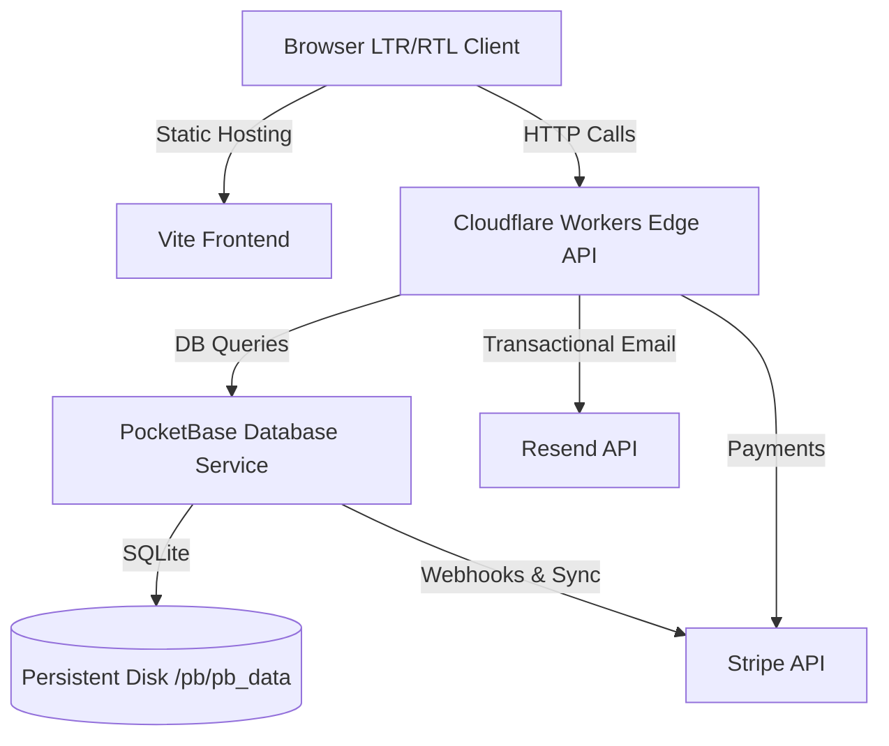

# Instant Grow — Production Deployment Guide

This guide outlines all the necessary steps to deploy the **Instant Grow** platform (frontend, serverless functions, database, and payment synchronization) to a production environment.

---

## Architecture Overview



---

## Pre-requisites

Make sure you have the following accounts and CLI tools installed before proceeding:
- **Cloudflare Account**: For hosting serverless Workers (and optionally frontend via Cloudflare Pages).
  - Install Wrangler CLI: `npm install -g wrangler`
- **Stripe Account**: For processing payments.
- **Resend Account**: For sending transactional emails.
- **Hosting Provider (for PocketBase)**: Fly.io, Railway, DigitalOcean, or Hetzner.
  - Install Fly CLI (if using Fly.io): [Fly CLI Installation Guide](https://fly.io/docs/hands-on/install-cli/)

---

## Step 1: Deploy PocketBase Database

PocketBase holds your operational data (users, orders, companies, documents, payments). It requires a persistent disk mount since it uses SQLite.

### Option A: Deploying on Fly.io (Recommended)

1. Open your terminal and navigate to the `pocketbase/` directory:
   ```bash
   cd pocketbase
   ```
2. Log in to your Fly.io account:
   ```bash
   fly auth login
   ```
3. Launch the deployment configuration:
   ```bash
   fly launch
   ```
   - *Note:* Follow the prompts to create the app. Fly.io will automatically parse [fly.toml](file:///g:/Vibe%20coding/IG%20website%20V2/pocketbase/fly.toml), build the [Dockerfile](file:///g:/Vibe%20coding/IG%20website%20V2/pocketbase/Dockerfile), allocate a persistent volume (`pb_data`), and attach it to `/pb/pb_data`.
4. Add your production `STRIPE_SECRET_KEY` secret to PocketBase (needed for hook execution):
   ```bash
   fly secrets set STRIPE_SECRET_KEY="sk_live_..."
   ```

### Option B: Deploying on a VPS (Docker Engine)

1. Copy the `pocketbase/` folder to your server.
2. Build the Docker image on your server:
   ```bash
   docker build -t pocketbase-prod -f pocketbase/Dockerfile pocketbase
   ```
3. Run the container, ensuring you mount a persistent volume for the data directory:
   ```bash
   docker run -d \
     -p 80:8080 \
     -v pb_data:/pb/pb_data \
     -e STRIPE_SECRET_KEY="sk_live_..." \
     --name pocketbase-prod \
     pocketbase-prod
   ```

---

## Step 2: Configure and Deploy Cloudflare Workers

We have 5 core workers in the `functions/` directory. Each needs to be configured and deployed.

### 1. Send Email Worker (`functions/send-email`)
Sends transactional emails (compliance alerts, receipts) via Resend.
```bash
cd functions/send-email
# Configure secrets
npx wrangler secret put RESEND_API_KEY
# Deploy
npx wrangler deploy
```

### 2. Create Checkout Worker (`functions/create-checkout`)
Creates Stripe Checkout sessions for package orders and add-on services.
```bash
cd ../create-checkout
# Configure secrets
npx wrangler secret put STRIPE_SECRET_KEY
npx wrangler secret put PB_ADMIN_EMAIL
npx wrangler secret put PB_ADMIN_PASSWORD
# Deploy
npx wrangler deploy
```

### 3. Stripe Webhook Worker (`functions/stripe-webhook`)
Processes Stripe webhook events and updates PocketBase order records.
```bash
cd ../stripe-webhook
# Configure secrets
npx wrangler secret put STRIPE_SECRET_KEY
npx wrangler secret put STRIPE_WEBHOOK_SECRET
npx wrangler secret put PB_ADMIN_EMAIL
npx wrangler secret put PB_ADMIN_PASSWORD
npx wrangler secret put RESEND_API_KEY
# Deploy
npx wrangler deploy
```

### 4. Delete User Worker (`functions/delete-user`)
Ensures clean, cascading database deletions for clients and admins.
```bash
cd ../delete-user
npx wrangler deploy
```

### 5. Submit Contact Worker (`functions/submit-contact`)
Receives customer contact forms and validates Turnstile CAPTCHAs.
```bash
cd ../submit-contact
# Configure secrets
npx wrangler secret put TURNSTILE_SECRET_KEY
npx wrangler deploy
```

*Note:* You can change the `ALLOWED_ORIGIN` and `PB_URL` default environment variables inside the `wrangler.toml` files in each folder to match your production domains before running `deploy`.

---

## Step 3: Seed Live Stripe Products and Prices

Once PocketBase is up and running in production, you must synchronize your product definitions and pricing options.

1. Ensure the database admin account exists on your production PocketBase instance (it will have run migrations automatically upon startup).
2. Set the Stripe live or test environment variables on your local machine:
   ```powershell
   # Windows PowerShell
   $env:STRIPE_SECRET_KEY="sk_live_..."
   $env:PB_URL="https://your-pocketbase-domain.com"
   $env:PB_ADMIN_EMAIL="admin@yourdomain.com"
   $env:PB_ADMIN_PASSWORD="YourAdminPassword123!"
   
   # Linux / macOS Bash
   export STRIPE_SECRET_KEY="sk_live_..."
   export PB_URL="https://your-pocketbase-domain.com"
   export PB_ADMIN_EMAIL="admin@yourdomain.com"
   export PB_ADMIN_PASSWORD="YourAdminPassword123!"
   ```
3. Run the synchronization script to create products on Stripe and save the pricing identifiers back to PocketBase:
   ```bash
   npm run db:sync-stripe
   ```

---

## Step 4: Deploy Frontend Client

The frontend can be built and deployed to any static hosting provider (e.g. Netlify, Vercel, or Cloudflare Pages).

### 1. Configure Production Environment Variables
Set the following environment variables in your hosting provider's admin dashboard:

| Variable | Description | Example Value |
| :--- | :--- | :--- |
| `VITE_PB_URL` | Your production PocketBase domain | `https://pb.instantgrow.net` |
| `VITE_CHECKOUT_ENDPOINT` | URL of deployed create-checkout Worker | `https://instantgrow-create-checkout.username.workers.dev` |
| `VITE_CONTACT_ENDPOINT` | URL of deployed submit-contact Worker | `https://instantgrow-submit-contact.username.workers.dev` |
| `VITE_DELETE_USER_ENDPOINT` | URL of deployed delete-user Worker | `https://instantgrow-delete-user.username.workers.dev` |
| `VITE_R2_UPLOAD_ENDPOINT` | URL of deployed upload-validator Worker | `https://instantgrow-upload-validator.username.workers.dev` |
| `VITE_EMAIL_ENDPOINT` | URL of deployed send-email Worker | `https://instantgrow-send-email.username.workers.dev` |
| `VITE_TURNSTILE_SITE_KEY` | Production Cloudflare Turnstile key | `0x4AAAAAA...` |

### 2. Run the Production Build Command
Configure the build settings in your provider's dashboard:
- **Build Command**: `npm run build`
- **Output Directory**: `dist`

---

## Step 5: Post-Deployment Smoke Test

Perform a quick sanity check to ensure the production pipelines are working correctly:
1. Load the landing page and switch languages LTR ↔ RTL.
2. Navigate to `/order`, choose a formation plan, fill out details, and verify redirect to Stripe Checkout works.
3. Submit the Contact Form and verify the message appears under "Messages" in the Admin Dashboard.
4. Log in as an administrator to `https://your-pocketbase-domain.com/_/` and verify that all tables are migrated, seed data exists, and security rules are active.
